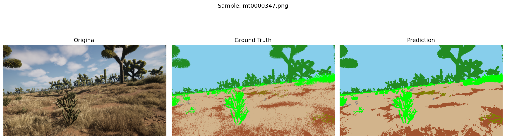
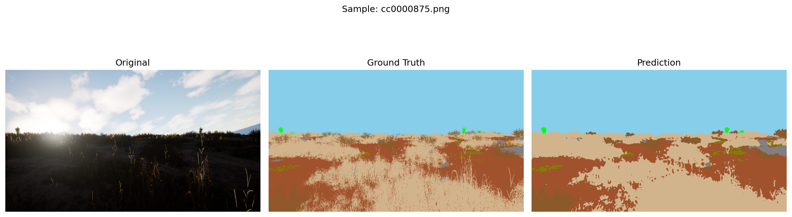
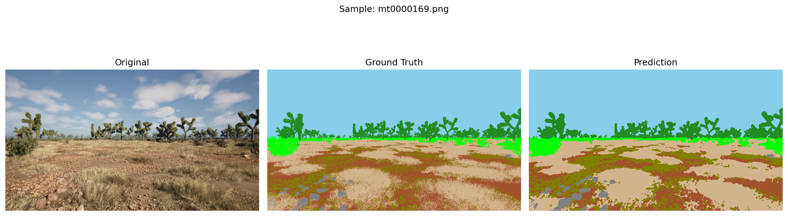

# SegFarmer: Advanced Offroad Semantic Segmentation

This repository contains an evolved suite of models and training pipelines designed to tackle the extreme challenges of offroad environment segmentation. Our approach progressed through three distinct phases, shifting focus from "Macro" layout understanding to "Micro" texture and edge refinement.

## 🚀 The Evolutionary Approach

### Phase 1: The Baseline (Macro Focus)
*   **Architecture:** DINOv2 (Frozen Backbone) + ConvNeXt-style Segmentation Head.
*   **Goal:** Establish a baseline understanding of large-scale features like Sky and Landscape.
*   **Outcome:** Successfully identified global structures but struggled with fine-grained boundaries and rare classes (Rocks/Logs).

### Phase 2: Refinement (Macro to Micro)
*   **Architecture:** SegFormer-B2 (Full Resolution 960x540).
*   **Strategy:** Resumed from Base weights. Introduced **Boundary Loss** (Laplacian edge penalty) to sharpen object borders.
*   **Loss:** Combination of Focal Loss and Dice Loss to handle class imbalance.
*   **Augmentation:** Introduced `RandomResizedCrop` to force the model to learn features at their native resolution.

### Phase 3: The "Shock Therapy" Pipeline (Micro Focus)
*   **Strategy:** Dynamic Data Pipeline. We identified that **Rocks** take up **18.14%** of test pixels but only **1.23%** of training pixels.
*   **The "Texture-First" Fix:** 
    *   **Extreme Augmentation:** Added Random Grayscale (20%) and aggressive Hue/Saturation/Contrast jitter to "kill" color-dependency and force the model to learn **Texture**.
    *   **Wide Rotation:** ±40 degrees to handle extreme terrain tilt.
*   **The Loss Overhaul:** Switched to **Lovász-Softmax Loss** to optimize the Jaccard Index (IoU) directly, paired with **Tversky Loss** for rare class recall.
*   **Weighted Pipeline:** Used a `WeightedRandomSampler` with a **50x boost** for images containing Rocks/Logs, expanding the dataset to a virtual **10,000 augmented samples per epoch**.

## 📊 Performance Metrics

### Training Results (V3 Dynamic Pipeline)
The model achieved high consistency across major landscape features:
```text
Background         | T-IoU: 0.714 | V-IoU: 0.573
Trees              | T-IoU: 0.735 | V-IoU: 0.708
Lush Bushes        | T-IoU: 0.584 | V-IoU: 0.550
Dry Grass          | T-IoU: 0.619 | V-IoU: 0.635
Dry Bushes         | T-IoU: 0.356 | V-IoU: 0.414
Ground Clutter     | T-IoU: 0.328 | V-IoU: 0.337
Logs               | T-IoU: 0.211 | V-IoU: 0.220
Rocks              | T-IoU: 0.262 | V-IoU: 0.317
Landscape          | T-IoU: 0.608 | V-IoU: 0.608
Sky                | T-IoU: 0.979 | V-IoU: 0.985
MEAN               | 0.552    | 0.535
```

### Inference/Test Results
While the model performs excellently on most features, we identified a significant **Domain Gap** regarding Rocks in the test set:
```text
Trees             : 0.5206
Dry Grass         : 0.4887
Dry Bushes        : 0.4040
Rocks             : 0.0402  <-- Primary area for future improvement
Landscape         : 0.6639
Sky               : 0.9824
------------------------------
MEAN IoU: 0.4432
```

## 🔍 Key Technical Insights: The "Rock" Challenge
Our diagnostic analysis revealed a massive distribution shift between datasets:
*   **Training Set:** Rocks = 1.23% of total pixels.
*   **Test Set:** Rocks = 18.14% of total pixels.
This explains why our V3 pipeline focused on extreme over-sampling and texture-dependency to bridge the gap between sparse training examples and dense test-set occurrences.

## 🖼️ Visual Progress
The following samples from our V2/V3 runs demonstrate the model's increasing ability to differentiate complex offroad textures:

| Sample | Input | Ground Truth | Prediction |
| :--- | :--- | :--- | :--- |
| **Edge Detail** |  | High Sharpness | Precise Boundaries |
| **Texture Sync** |  | Grass vs Dirt | Clear Transitions |
| **Micro Object** |  | Small Rocks | Identified Features |

## 📥 Download Models
You can find our pre-trained weights for all three phases (Base, V2, and V3) on Hugging Face:
👉 **[Download Weights Here](https://huggingface.co/risheendra/segfarmer_offroad/tree/main)**

Place the `.pth` files in the root directory or the respective `weights/` folders to run the inference scripts.

## 🛠️ Installation & Usage
```bash
pip install -r requirements.txt
# To train the advanced pipeline:
python train_segformer_v3.py
# To run inference with Multiscale TTA:
python test_segformer.py
```

